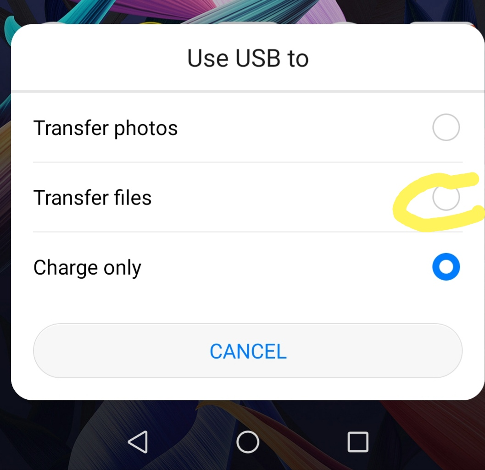
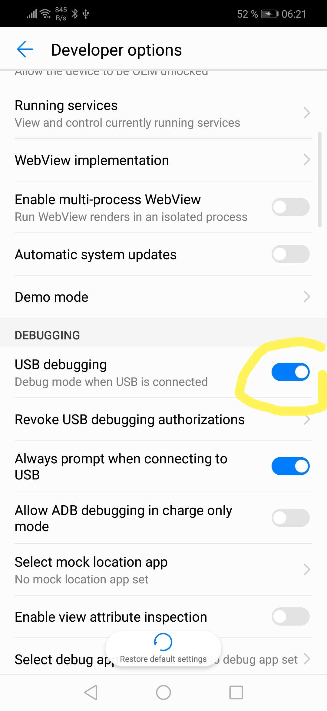

# React Native

The react native documentation requests that you use expo-cli but this comes with some caveats if you are creating apps for clients.

Using the `react-native-cli` is just a simple to use. It just requires some configuration.

# Node version

You node version will require to be 8.3 or newer.

If you are not using `nvm` already then I suggest installing it now as you are going to need it.

[https://github.com/creationix/nvm#install-script](https://github.com/creationix/nvm#install-script)

# Install node version 8.3 or newer. 

To check out the versions of node look the following link:

[https://github.com/nodejs/Release#release-schedule](https://github.com/nodejs/Release#release-schedule)

I would recommend using a minimum of version 10 because the 'End-of-life' is April 2021. This gives you enough time to know that the version of node will be good for a couple of years.

Lets go ahead and install `10.5.1`

[https://nodejs.org/download/release/latest-v10.x/](https://nodejs.org/download/release/latest-v10.x/)

```bash
nvm install 10.15.1
```

> use 10.15.1

```bash
nvm use 10.15.1
```

# Install react-native-cli

If you will need to install this now if this is the first time you have `use`'d this node version.


```bash
npm install -g react-native-cli
/home/david/.nvm/versions/node/v10.15.1/bin/react-native -> /home/david/.nvm/versions/node/v10.15.1/lib/node_modules/react-native-cli/index.js
+ react-native-cli@2.0.1
added 41 packages from 15 contributors in 2.42s
```

# Initialise project

So lets go ahead and make our example project called `exampleapp` in this folder.

```bash
react-native init exampleapp --typescript
```

# Run the app

If everything was successful then you should see the following output:

```bash
To run your app on iOS:
cd /home/david/react-app/exampleapp
react-native run-ios
- or -
Open ios/exampleapp.xcodeproj in Xcode
Hit the Run button
To run your app on Android:
cd /home/david/react-app/exampleapp
Have an Android emulator running (quickest way to get started), or a device connected
react-native run-android
```

# Enable Transfer files

ake sure when you plug the phone in to select Transfer files.




# Enable USB Debugging





# Install app on phone

```bash
cd exampleapp
react-native run-android
```

# Uninstalling the application

Be warned if you delete the app directly on the phone, you are going to have lots of problems with reinstalling it again using `react-native run-android` command.

Use the following command to safely remove the app.

```bash
cd android
./gradlew uninstallDebug
```

If you dont do this and uninstall the app directly on the phone you will receive this problem.

```bash
BUILD SUCCESSFUL in 6s
28 actionable tasks: 1 executed, 27 up-to-date
adb server version (36) doesn't match this client (39); killing...
* daemon started successfully
Running /home/david/Android/Sdk/platform-tools/adb -s HYF0218928043367 reverse tcp:8081 tcp:8081
adb server version (39) doesn't match this client (36); killing...
* daemon started successfully *
Starting the app on HYF0218928043367 (/home/david/Android/Sdk/platform-tools/adb -s HYF0218928043367 shell am start -n com.exampleapp/com.exampleapp.MainActivity)...
Starting: Intent { cmp=com.exampleapp/.MainActivity }
Error type 3
Error: Activity class {com.exampleapp/com.exampleapp.MainActivity} does not exist.
```

# Generating Signed APK

To install the application withouth having to have a running server your machine you will be required to create a signed apk which can be installed to your phone.

Following the instructions which are outlined in the link below:

[https://facebook.github.io/react-native/docs/signed-apk-android](https://facebook.github.io/react-native/docs/signed-apk-android)

Or!!

Do it this way.

The command below will ask you a whole bunch of questions, answer all of them until it completes.

```bash
keytool -genkey -v -keystore my-release-key.keystore -alias my-key-alias -keyalg RSA -keysize 2048 -validity 10000

Enter keystore password: 12345678
Re-enter new password:  12345678
What is your first and last name?
  [Unknown]:  David Thorn
What is the name of your organizational unit?
  [Unknown]:  exampleapp
What is the name of your organization?
  [Unknown]:  exampleapp
What is the name of your City or Locality?
  [Unknown]:  example app city
What is the name of your State or Province?
  [Unknown]:  example app state
What is the two-letter country code for this unit?
  [Unknown]:  DE
Is CN=David Thorn, OU=exampleapp, O=exampleapp, L=example app city, ST=example app state, C=DE correct?
  [no]:  yes

Generating 2,048 bit RSA key pair and self-signed certificate (SHA256withRSA) with a validity of 10,000 days
        for: CN=David Thorn, OU=exampleapp, O=exampleapp, L=example app city, ST=example app state, C=DE
Enter key password for <my-key-alias>
        (RETURN if same as keystore password):
[Storing my-release-key.keystore]

Warning:
The JKS keystore uses a proprietary format. It is recommended to migrate to PKCS12 which is an industry standard format using "keytool -importkeystore -srckeystore my-release-key.keystore -destkeystore my-release-key.keystore -deststoretype pkcs12".

```

You should now have a `my-release-key.keystor` file in your folder.

# Setting up gradle variables

Place the `my-release-key.keystore` file under the android/app directory in your project folder.
Edit the file `~/.gradle/gradle.properties` or android/gradle.properties, and add the following (replace ***** with the correct keystore password, alias and key password),

```groovy
MYAPP_RELEASE_STORE_FILE=my-release-key.keystore
MYAPP_RELEASE_KEY_ALIAS=my-key-alias
MYAPP_RELEASE_STORE_PASSWORD=12345678
MYAPP_RELEASE_KEY_PASSWORD=12345678
```

# Adding signing config to your app's gradle config

Edit the file `android/app/build.gradle` in your project folder, and add the signing config,

```groovy
...
android {
    ...
    defaultConfig { ... }
    signingConfigs {
        release {
            if (project.hasProperty('MYAPP_RELEASE_STORE_FILE')) {
                storeFile file(MYAPP_RELEASE_STORE_FILE)
                storePassword MYAPP_RELEASE_STORE_PASSWORD
                keyAlias MYAPP_RELEASE_KEY_ALIAS
                keyPassword MYAPP_RELEASE_KEY_PASSWORD
            }
        }
    }
    buildTypes {
        release {
            ...
            signingConfig signingConfigs.release
        }
    }
}
...
```

# Build Release

Simply run the following in a terminal:

```bash
cd android
./gradlew assembleRelease
```

Before you go ahead and install the app to your phone, make sure that you uninstall any other version which you may have install already.

```bash
./gradlew uninstallDebug
```

# Thats It